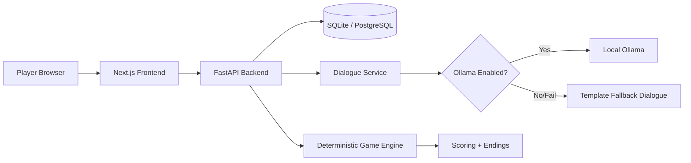
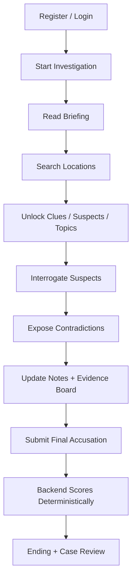

# ECHOES OF THE ALIBI

Tagline: Every suspect remembers the night differently.

## 1. Purpose

Echoes of the Alibi is a full-stack AI-assisted detective game where players investigate a fictional case, interrogate suspects, connect evidence, expose contradictions, and submit a final accusation scored by a deterministic backend game engine.

This project uses fictional characters and events.
The LLM performs constrained character dialogue.
The backend owns the authoritative case state and solution.
Ollama is optional because deterministic fallback dialogue is included.

## 2. Main Gameplay Features

- One complete case: The Midnight Gallery
- 5 suspects with unique personalities, motives, and timelines
- 5 explorable locations with unlock rules
- 13 clues, 5 contradictions, 3 red herrings
- Action-limited investigation loop
- AI interrogation with strict JSON schema
- React Flow evidence board with save/load
- Detective notes, timeline review, final accusation, and multiple endings

## 3. Tech Stack

### Frontend
- Next.js App Router
- TypeScript
- Tailwind CSS
- Zustand
- TanStack Query
- React Hook Form + Zod
- Lucide React
- Framer Motion
- React Flow
- Axios

### Backend
- FastAPI
- SQLAlchemy 2.x
- Pydantic 2
- Alembic
- JWT auth (python-jose)
- Passlib + bcrypt
- HTTPX (Ollama integration)

### Database
- SQLite by default
- Configurable DATABASE_URL for PostgreSQL later

### AI
- Local Ollama model via environment variables
- Deterministic fallback mode when Ollama is unavailable

### Testing
- Pytest (backend)
- Vitest (frontend)

### Tooling
- Docker + Docker Compose
- GitHub Actions CI
- Ruff + ESLint + TypeScript strict mode

## 4. Architecture Overview

Frontend consumes authenticated backend REST endpoints.
Backend enforces game rules, security checks, and authoritative state transitions.
LLM responses are validated and sanitized, but never trusted for scoring/unlocks.

## 5. System Architecture Diagram



## 6. Game Flow Diagram



## 7. Repository Structure

See the monorepo tree under:
- frontend/
- backend/
- docs/

## 8. Prerequisites

- Node.js 20+
- Python 3.11+
- pip
- Docker Desktop (optional)
- Ollama (optional)

## 9. Local Setup Instructions

Clone and enter project root:

```bash
cd echoes-of-the-alibi
```

## 10. Ollama Setup

1. Install Ollama from official distribution.
2. Pull model configured in backend .env:

```bash
ollama pull llama3.1:8b
```

3. Start Ollama service.

## 11. Run Without Ollama

Set in backend .env:

```env
OLLAMA_ENABLED=false
```

Game remains playable with deterministic fallback dialogue.

## 12. Environment Variables

### Backend

- APP_NAME
- APP_ENV
- DEBUG
- API_PREFIX
- DATABASE_URL
- JWT_SECRET_KEY
- JWT_ALGORITHM
- ACCESS_TOKEN_EXPIRE_MINUTES
- CORS_ORIGINS
- OLLAMA_ENABLED
- OLLAMA_BASE_URL
- OLLAMA_MODEL
- OLLAMA_TIMEOUT_SECONDS
- AI_PROMPT_VERSION
- MAX_CHAT_MESSAGE_LENGTH
- INTERVIEW_RATE_LIMIT

### Frontend

- NEXT_PUBLIC_API_BASE_URL
- NEXT_PUBLIC_APP_NAME
- NEXT_PUBLIC_ENABLE_AI_DEBUG

## 13. Database Migration Instructions

```bash
cd backend
alembic upgrade head
```

## 14. Seed Instructions

```bash
cd backend
python -m app.seed.seed
```

## 15. Backend Run Instructions

```bash
cd backend
python -m venv .venv
# Windows PowerShell
. .venv/Scripts/Activate.ps1
pip install -e .[dev]
copy .env.example .env
alembic upgrade head
python -m app.seed.seed
uvicorn app.main:app --reload
```

## 16. Frontend Run Instructions

```bash
cd frontend
npm install
copy .env.example .env.local
npm run dev
```

## 17. Docker Compose Instructions

```bash
copy backend/.env.example backend/.env
copy frontend/.env.example frontend/.env.local
docker compose build
docker compose up -d
docker compose logs -f
docker compose down
```

For first boot migrations/seed:

```bash
docker compose exec backend alembic upgrade head
docker compose exec backend python -m app.seed.seed
```

## 18. Test Commands

Backend:

```bash
cd backend
pytest -q
```

Frontend:

```bash
cd frontend
npm test
```

## 19. API Documentation

- Swagger UI: http://localhost:8000/docs
- OpenAPI JSON: http://localhost:8000/openapi.json

## 20. Default Development URLs

- Frontend: http://localhost:3000
- Backend: http://localhost:8000

## 21. Security Considerations

- JWT auth with hashed passwords
- Generic auth errors
- Investigation ownership checks
- Message length limits
- LLM output validation and sanitization
- Prompt-constrained dialogue actor model
- In-memory rate limiting for interviews (development-only)

For scaled deployment, replace in-memory rate limiting with shared infrastructure (Redis or equivalent).

## 22. Known Limitations

- Rate limiting is process-local and non-distributed
- Token storage uses localStorage in MVP client
- Frontend test suite is compact and can be expanded with more interaction tests

## 23. Future Improvements

- Redis rate limiting and session invalidation
- Deeper dialogue memory and richer topic trees
- Rich timeline visual analytics and ending replays
- Multiplayer detective mode

## 24. Portfolio and Resume Summary

This project demonstrates full-stack product engineering across:
- secure API design
- deterministic game systems
- AI integration with guardrails
- modern frontend architecture
- CI/CD and Dockerized developer workflows

## 25. Troubleshooting

- 401 errors: verify token exists and backend secret is consistent.
- No AI response: check Ollama service, model name, or set OLLAMA_ENABLED=false.
- Empty case list: run seed command.
- CORS issues: verify CORS_ORIGINS includes frontend host.

## 26. Screenshot Placeholders

See docs/screenshots.md for recommended captures.

## 27. License

MIT License. See LICENSE.

